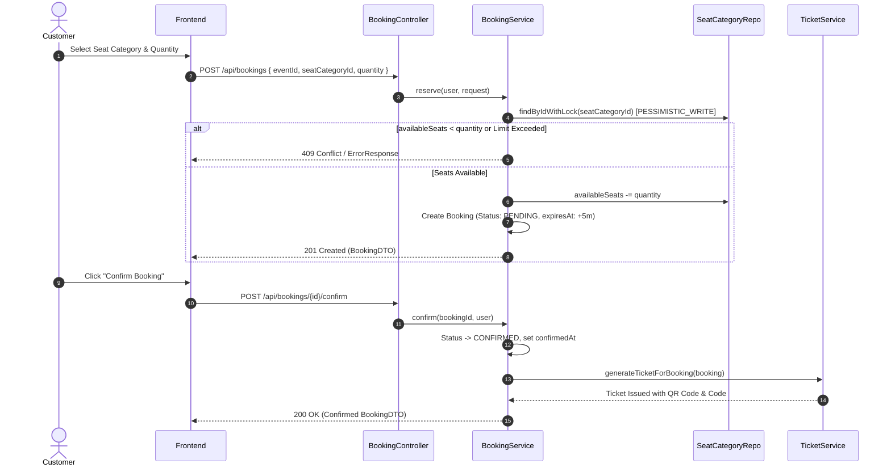
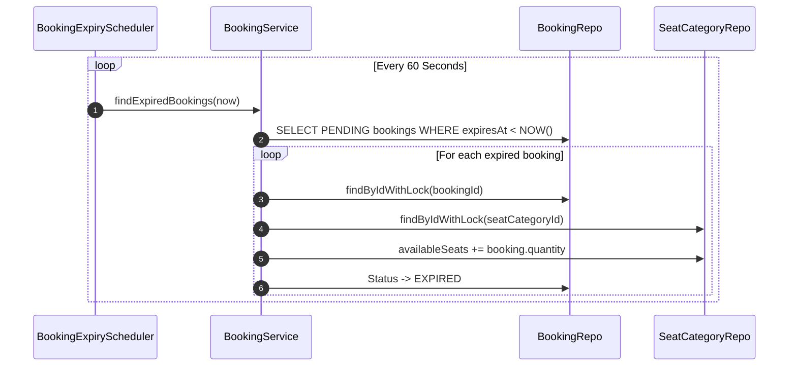
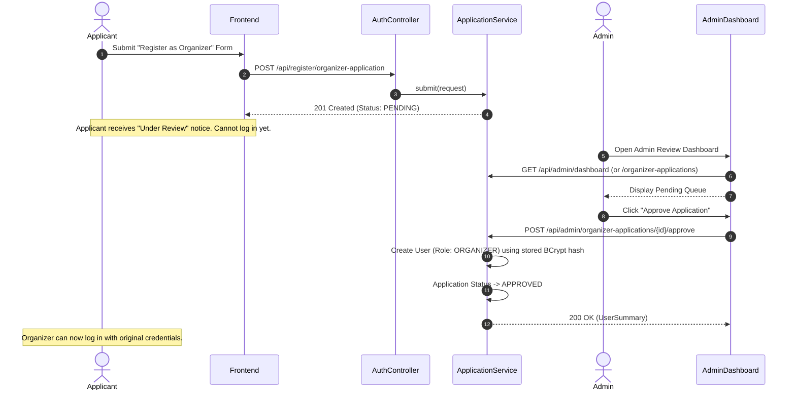

# Software Requirements Specification (SRS v2.0)
## Event Ticketing Platform (Eventix)

---

### 1. Introduction & Overview

#### 1.1 Purpose
This document provides the updated, definitive Software Requirements Specification (SRS) for **Eventix (EventTicketingPlatform)**. It captures the complete system architecture, data schemas, REST API contracts, state transition rules, pessimistic-locking concurrency mechanisms, security policies, and Angular standalone frontend structure as actually implemented and verified in the codebase.

#### 1.2 System Scope
Eventix is a full-stack event discovery, booking, and ticket-management platform featuring:
- **Role-Based Workflows**: Customer self-registration, Admin-reviewed Organizer applications, and full Administrator supervision.
- **Venue & Event Lifecycle**: Organizer venue requests, Admin venue approval, DRAFT to PUBLISHED event workflows with seat pricing tiers.
- **Concurrency-Safe Seat Reservation**: Database-level pessimistic row locking (`@Lock(LockModeType.PESSIMISTIC_WRITE)`) on seat categories to guarantee zero overselling.
- **Booking State Machine & Automated Expiry**: 5-minute `PENDING` hold window managed by an automated background scheduler (`BookingExpiryScheduler`).
- **Ticket Generation & PDF Encoding**: Single ticket issued per booking with cryptographically secure alphanumeric codes, OpenPDF layout, and ZXing QR code rendering.
- **Unified Admin Dashboard**: Side-by-side review of pending organizer applications and pending venue approval requests.
- **Modern Angular Frontend**: Signals-driven, standalone component architecture with lazy routing, Signal Forms, custom route guards, and HttpInterceptors.

---

### 2. Architecture & Technical Stack

```
+-----------------------------------------------------------------------------------+
|                                 ANGULAR FRONTEND                                  |
|   Standalone Components | Signals | Signal Forms | RxJS | Guards | Interceptors   |
+-----------------------------------------------------------------------------------+
                                          |  HTTP / REST (Bearer JWT)
                                          v
+-----------------------------------------------------------------------------------+
|                               SPRING BOOT BACKEND                                 |
|   REST Controllers -> Services -> Spring Data JPA -> Liquibase -> Security (JWT)  |
+-----------------------------------------------------------------------------------+
                                          |  Pessimistic Locking / SQL
                                          v
+-----------------------------------------------------------------------------------+
|                              POSTGRESQL 16 DATABASE                               |
|   Users | Organizer Applications | Venues | Events | Seat Categories | Bookings   |
+-----------------------------------------------------------------------------------+
```

#### 2.1 Technology Stack Table

| Component | Technology | Version / Specification |
| :--- | :--- | :--- |
| **Backend Framework** | Java / Spring Boot | Java 21, Spring Boot 3.x, Spring MVC |
| **Security** | Spring Security + JJWT | Bearer JWT (1-hour expiry, stateless sessions) |
| **Persistence Layer** | Spring Data JPA / Hibernate | PostgreSQL 16 dialect, Pessimistic Row Locking |
| **Database Migrations** | Liquibase | XML/YAML changelogs in `db/changelog` |
| **Document Generation** | OpenPDF + ZXing | PDF ticket rendering with embedded QR codes |
| **Frontend Framework** | Angular | Angular 22, TypeScript, Standalone Components |
| **Reactive State** | Angular Signals | `signal()`, `computed()`, Signal Forms |
| **Containerization** | Docker & Kubernetes | Docker Compose, Minikube manifests (`/Infrastructure/k8s`) |

---

### 3. User Roles & Access Control

| Role | Operational Scope & Permissions |
| :--- | :--- |
| **Public / Anonymous** | Browse published events, search/filter catalog, view event details & live availability, register customer account, submit organizer application. |
| **Customer** | All Public actions + reserve seats (creates PENDING booking), confirm booking (generates Ticket), cancel own booking, view own bookings & tickets, download PDF ticket. |
| **Organizer** | All Customer actions on own events + submit venue requests, create/edit DRAFT events, publish events, edit seat categories, view attendee/booking lists for owned events, check-in ticket codes. |
| **Admin** | Unrestricted global access: Full CRUD on users/events/venues, review pending organizer applications, review/approve/reject venue requests, void tickets, cancel any event/booking, manage platform roles. |

---

### 4. Critical Process Flows

#### Flow 1: Customer Seat Reservation & Confirmation


#### Flow 2: 5-Minute Booking Expiration (Background Scheduler)


#### Flow 3: Non-Instant Organizer Application & Approval


---

### 5. Detailed Data Models & Entity Schemas

#### 5.1 User Entity (`users`)
- `id`: UUID (Primary Key, Auto-generated)
- `name`: String (Required, max length 255)
- `email`: String (Required, Unique, indexed)
- `phone`: String (Optional, Unique)
- `password`: String (Required, BCrypt hashed)
- `role`: Enum (`CUSTOMER`, `ORGANIZER`, `ADMIN`)
- `createdAt`: Instant (Required, immutable)

#### 5.2 OrganizerApplication Entity (`organizer_applications`)
- `id`: UUID (PK)
- `name`: String (Required)
- `email`: String (Required, Unique)
- `phone`: String (Required)
- `passwordHash`: String (Required, BCrypt hash stored at submission time)
- `organizationName`: String (Optional)
- `reason`: Text (Optional)
- `status`: Enum (`PENDING`, `APPROVED`, `REJECTED`)
- `submittedAt`: Instant (Required)
- `reviewedAt`: Instant (Nullable)
- `reviewedBy`: FK → `User` (Nullable)
- `rejectionReason`: String (Nullable)

#### 5.3 Venue Entity (`venues`)
- `id`: UUID (PK)
- `name`: String (Required, max 100)
- `address`: String (Required, max 255)
- `capacity`: Integer (Required, > 0)
- `requestedBy`: FK → `User` (Required)
- `status`: Enum (`PENDING`, `APPROVED`, `REJECTED`)
- `reviewedAt`: LocalDateTime (Nullable)
- `reviewedBy`: FK → `User` (Nullable)

#### 5.4 Event Entity (`events`)
- `id`: UUID (PK)
- `title`: String (Required, max 150)
- `description`: Text (Optional)
- `category`: Enum (`MUSIC`, `SPORTS`, `CONFERENCE`, `THEATRE`, `OTHER`)
- `eventDate`: LocalDate (Required)
- `eventTime`: LocalTime (Required)
- `status`: Enum (`DRAFT`, `PUBLISHED`, `CANCELLED`)
- `venueId`: FK → `Venue` (Required)
- `organizerId`: FK → `User` (Required)
- `createdAt`: LocalDateTime (Required)
- `updatedAt`: LocalDateTime (Required)

#### 5.5 SeatCategory Entity (`seat_categories`)
- `id`: UUID (PK)
- `event`: FK → `Event` (Required)
- `venue`: FK → `Venue` (Required)
- `name`: String (Required, max 100)
- `price`: BigDecimal (Required, ≥ 0, scale 2)
- `totalSeats`: Integer (Required, > 0)
- `availableSeats`: Integer (Required, 0 ≤ availableSeats ≤ totalSeats)
- `seatingCapacity`: Integer (Per-person limit per category, default 1)

#### 5.6 Booking Entity (`booking`)
- `id`: UUID (PK)
- `user`: FK → `User` (Required)
- `event`: FK → `Event` (Required)
- `seatCategory`: FK → `SeatCategory` (Required)
- `quantity`: Integer (Required, > 0)
- `status`: Enum (`PENDING`, `CONFIRMED`, `CANCELLED`, `EXPIRED`)
- `totalPrice`: BigDecimal (Required, quantity × category price)
- `createdAt`: Instant (Required)
- `confirmedAt`: Instant (Nullable)
- `cancelledAt`: Instant (Nullable)
- `expiresAt`: Instant (Required, createdAt + 5 minutes)

#### 5.7 Ticket Entity (`tickets`)
- `id` / `uuid`: UUID (PK)
- `ticketCode`: String (Required, Unique alphanumeric code)
- `bookingId`: FK → `Booking` (Required, Unique constraint - 1 ticket per booking)
- `seat`: FK → `SeatCategory` (Required)
- `evnt`: FK → `Event` (Required)
- `venue`: FK → `Venue` (Required)
- `userOwnerUUID`: FK → `User` (Required)
- `quantity`: Integer (Required, total seats covered by ticket)
- `totalPrice`: BigDecimal (Required)
- `status`: Enum (`ISSUED`, `CHECKED_IN`, `CANCELLED`)
- `createdAt`: Instant (Required)
- `checkedInAt`: Instant (Nullable)

---

### 6. State Machine Specifications

#### 6.1 Event Lifecycle State Machine
```
[DRAFT] ---publish()---> [PUBLISHED] ---cancel()---> [CANCELLED]
   |                                                    ^
   +----------------------cancel()----------------------+
```
- **Rules**: Events are created in `DRAFT`. Publishing requires an `APPROVED` venue, a future date/time, and at least one seat category with `totalSeats > 0`. Cancelling an event transitions all associated active bookings to `CANCELLED` and restores seat counts.

#### 6.2 Booking State Machine
```
[PENDING] ---confirm()---> [CONFIRMED] ---cancel()---> [CANCELLED]
   |                           |
   +---cancel()---> [CANCELLED] +---event_cancel()---> [CANCELLED]
   |
   +---(5 min timeout)---> [EXPIRED]
```
- **Rules**: Booking creation atomically decrements `availableSeats` and sets status to `PENDING` with a 5-minute TTL (`expiresAt`). Confirming transitions status to `CONFIRMED` and generates a single ticket. Manual cancellation or auto-expiration returns `quantity` back to `availableSeats`.

#### 6.3 Venue & Application Review State Machines
```
[PENDING] ---approve()---> [APPROVED]
   |
   +---------reject()----> [REJECTED]
```
- **Rules**: Pending organizer applications approved by Admin create a live `User` (`role=ORGANIZER`). Pending venue requests approved by Admin become available for event selection. Admin direct venue creations bypass review and default to `APPROVED`.

---

### 7. REST API Specification

#### 7.1 Authentication & Registration (`/api`)
| Method | Endpoint Path | Auth / Role | Request Body | Description & Response |
| :--- | :--- | :--- | :--- | :--- |
| `POST` | `/api/register` | Public | `RegisterRequest` (name, email, phone, password) | 201 Created -> Returns `UserSummary` (CUSTOMER role). |
| `POST` | `/api/register/organizer-application` | Public | `SubmitRequest` (name, email, phone, password, organizationName, reason) | 201 Created -> Creates `PENDING` application. |
| `POST` | `/api/login` | Public | `LoginRequest` (email/phone, password) | 200 OK -> `{ token, user }` or 401 if application pending review. |

#### 7.2 Public Catalog & Discovery (`/api`)
| Method | Endpoint Path | Auth / Role | Query Parameters | Description & Response |
| :--- | :--- | :--- | :--- | :--- |
| `GET` | `/api/events` | Public | `category`, `dateFrom`, `dateTo`, `minPrice`, `maxPrice`, `venueId`, `organizerId`, `page`, `size` | 200 OK -> Paginated `PageResponse<EventDto.Summary>` of PUBLISHED events. |
| `GET` | `/api/events/{id}` | Public | - | 200 OK -> Full `EventDto.Response` with venue & seat categories. |
| `GET` | `/api/events/venues` | Public | - | 200 OK -> List of all `APPROVED` venues. |
| `GET` | `/api/events/{eventId}/seat-categories` | Public | - | 200 OK -> List of seat categories for event. |

#### 7.3 Bookings & Tickets (`/api`)
| Method | Endpoint Path | Auth / Role | Request Body | Description & Response |
| :--- | :--- | :--- | :--- | :--- |
| `POST` | `/api/bookings` | Authenticated | `CreateRequest` (eventId, seatCategoryId, quantity) | 201 Created -> Creates `PENDING` booking with row lock. |
| `POST` | `/api/bookings/{id}/confirm` | Customer Owner | - | 200 OK -> Status -> `CONFIRMED`, issues Ticket. |
| `POST` | `/api/bookings/{id}/cancel` | Customer / Admin | - | 200 OK -> Status -> `CANCELLED`, releases seats. |
| `GET` | `/api/bookings/my` | Customer | - | 200 OK -> List of customer's bookings. |
| `GET` | `/api/tickets/my` | Customer | - | 200 OK -> List of customer's tickets. |
| `GET` | `/api/tickets/my/booking/{bookingId}` | Customer Owner | - | 200 OK -> Ticket details for booking. |
| `GET` | `/api/tickets/my/booking/{bookingId}/pdf` | Customer Owner | - | 200 OK -> Downloads PDF ticket with embedded QR code. |

#### 7.4 Organizer Management (`/api/organizer`)
| Method | Endpoint Path | Auth / Role | Request Body | Description & Response |
| :--- | :--- | :--- | :--- | :--- |
| `GET` | `/api/organizer/events` | Organizer / Admin | `status`, `category`, `page`, `size` | 200 OK -> List organizer's own events. |
| `POST` | `/api/organizer/events` | Organizer / Admin | `CreateRequest` (title, description, category, eventDate, eventTime, venueId) | 201 Created -> Creates `DRAFT` event. |
| `PUT` | `/api/organizer/events/{id}` | Organizer Owner | `UpdateRequest` | 200 OK -> Updates event metadata. |
| `POST` | `/api/organizer/events/{id}/publish` | Organizer Owner | - | 200 OK -> Transitions event to `PUBLISHED`. |
| `POST` | `/api/organizer/events/{id}/cancel` | Organizer Owner | - | 200 OK -> Cancels event & active bookings. |
| `POST` | `/api/organizer/events/{eventId}/seat-categories` | Organizer Owner | `CreateRequest` (name, price, totalSeats, seatingCapacity) | 201 Created -> Adds seat category. |
| `PUT` | `/api/organizer/seat-categories/{id}` | Organizer Owner | `UpdateRequest` | 200 OK -> Updates seat category. |
| `POST` | `/api/organizer/venues` | Organizer | `CreateRequest` (name, address, capacity) | 201 Created -> Submits `PENDING` venue request. |
| `GET` | `/api/organizer/venues` | Organizer | `status` | 200 OK -> List submitted venues. |
| `GET` | `/api/organizer/events/{eventId}/bookings` | Organizer Owner | - | 200 OK -> List bookings/attendees for event. |
| `POST` | `/api/tickets/organizer/events/{eventId}/check-in` | Organizer Owner | `CheckInRequest` (ticketCode) | 200 OK -> Checks in ticket (`CHECKED_IN`). |

#### 7.5 Administrator Supervision (`/api/admin`)
| Method | Endpoint Path | Auth / Role | Request Body | Description & Response |
| :--- | :--- | :--- | :--- | :--- |
| `GET` | `/api/admin/dashboard` | Admin | - | 200 OK -> Combined dashboard of pending applications & venues. |
| `GET` | `/api/admin/organizer-applications` | Admin | `status` | 200 OK -> List organizer applications. |
| `POST` | `/api/admin/organizer-applications/{id}/approve` | Admin | - | 200 OK -> Approves application, creates ORGANIZER User. |
| `POST` | `/api/admin/organizer-applications/{id}/reject` | Admin | `RejectRequest` | 200 OK -> Rejects application. |
| `GET` | `/api/admin/venues` | Admin | `status` | 200 OK -> List all venue requests. |
| `POST` | `/api/admin/venues` | Admin | `CreateRequest` | 201 Created -> Creates auto-APPROVED venue. |
| `POST` | `/api/admin/venues/{id}/approve` | Admin | - | 200 OK -> Approves venue request. |
| `POST` | `/api/admin/venues/{id}/reject` | Admin | `RejectRequest` | 200 OK -> Rejects venue request. |
| `GET` | `/api/admin/events` | Admin | filters | 200 OK -> List all events across all statuses. |
| `PUT` | `/api/admin/events/{id}` | Admin | `AdminUpdateRequest` | 200 OK -> Overrides event state/metadata. |
| `DELETE` | `/api/admin/events/{id}` | Admin | - | 204 No Content -> Hard-deletes unbooked event. |
| `GET` | `/api/admin/users` | Admin | `role` | 200 OK -> List all platform users. |
| `PATCH` | `/api/admin/users/{id}/role` | Admin | `ChangeRoleRequest` | 200 OK -> Changes user role. |
| `DELETE` | `/api/admin/users/{id}` | Admin | - | 204 No Content -> Deletes non-admin user. |
| `GET` | `/api/admin/bookings` | Admin | - | 200 OK -> List all platform bookings. |
| `POST` | `/api/tickets/admin/{ticketId}/cancel` | Admin | - | 204 No Content -> Voids ticket. |

---

### 8. Concurrency & Locking Strategy

#### 8.1 Database-Level Pessimistic Row Locking
To satisfy critical non-overselling concurrency guarantees, all seat reservation write paths acquire an explicit PostgreSQL row lock via Spring Data JPA:
```java
@Lock(LockModeType.PESSIMISTIC_WRITE)
@Query("SELECT s FROM SeatCategory s WHERE s.id = :id")
Optional<SeatCategory> findByIdWithLock(@Param("id") UUID id);
```

#### 8.2 Unified Execution Path
Every operation that modifies `SeatCategory.availableSeats` (seat reservation, manual cancellation, event cancellation, and the automated 5-minute expiry scheduler) calls the exact same synchronized helper method:
```java
@Transactional
public void updateAvailableSeats(SeatCategory seatCategory, int amount) {
    int newAvailable = seatCategory.getAvailableSeats() + amount;
    if (newAvailable < 0 || newAvailable > seatCategory.getTotalSeats()) {
        throw new IllegalStateException("Seat availability boundary violation");
    }
    seatCategory.setAvailableSeats(newAvailable);
    seatCategoryRepository.save(seatCategory);
}
```

---

### 9. Error Handling & Validation Standard

All endpoints return uniform JSON error structures via a global `@ControllerAdvice`:
```json
{
  "timestamp": "2026-08-12T09:51:32Z",
  "status": 409,
  "error": "SEAT_UNAVAILABLE",
  "message": "Not enough seats available in this category",
  "fieldErrors": []
}
```

#### Standard Error Code Mapping
- **400 Bad Request**: Validation constraint failures (e.g., negative quantity, invalid email format).
- **401 Unauthorized**: Missing or expired JWT header.
- **403 Forbidden**: Accessing resources owned by another user without Admin privilege.
- **404 Not Found**: Resource UUID does not exist or event is not published.
- **409 Conflict**: Oversell attempt (`SeatUnavailableException`), duplicate email registration.

---

### 10. Angular Frontend Architecture

#### 10.1 Application Layout & Standalone Routes
- `core/`: Base HTTP interceptors (`JwtInterceptor`, `ErrorInterceptor`) and route guards.
- `components/`: Feature-grouped standalone components:
  - `auth/`: Login, Register, Organizer Application submission.
  - `events/`: Public event browsing, catalog filters, detail view.
  - `booking/`: Customer seat selection, My Bookings list with 5-minute countdown.
  - `customer/`: My Tickets view, PDF download button.
  - `organizer/`: Event management, seat category editor, venue request form.
  - `admin/`: Unified pending review dashboard, user management, global event & venue controls.

#### 10.2 Route Guards & Navigation Flow
- `guestGuard`: Prevents logged-in users from accessing login/signup.
- `authGuard`: Enforces active JWT for customer bookings.
- `customerGuard`: Restricts ticket/booking views to Customer role.
- `organizerGuard` / `organizerOrAdminGuard`: Restricts event creation and venue submissions.
- `adminGuard`: Restricts review queues and platform user controls.
